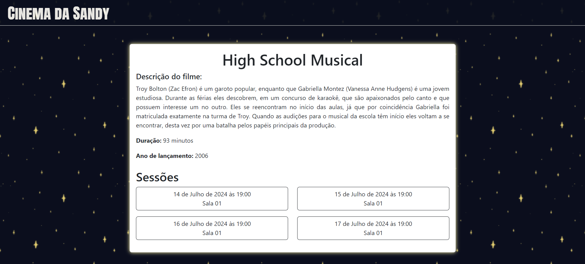
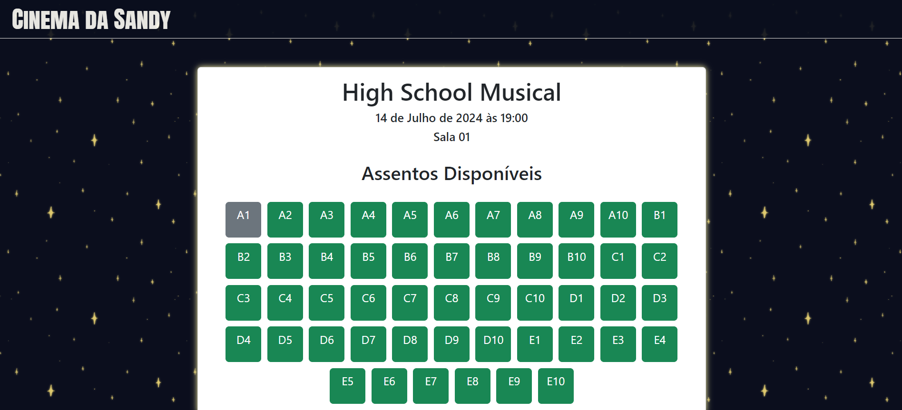
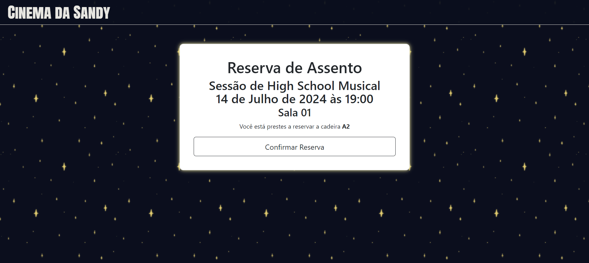
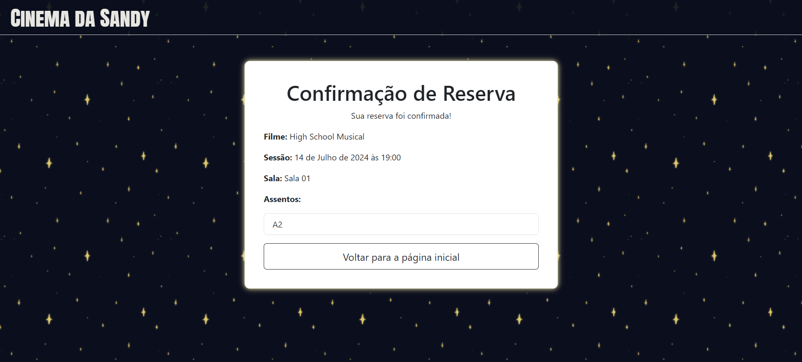

# django_cinema
(EN) Quick django application to learn and later mentorize. <br>
(PT) Aplicação em Django rápida para virar monitora no projeto "Escola de inverno em programação web para meninas" do grupo GRACE-ICMC.

## About the site
The project consists in a simulation of a cinema ticket-buying website, with a database that stores the movies on display (and its details), the movie theaters, the sessions, the seats and its availability.
### Home page


### Movie detail (Choose the session)

### Choosing the seat

### Confirm the reservation

### Seat booked!

## How to run
### Preparing the environment
Create a directory for the project and install a python virtual environment
```
mkdir projeto
cd projeto
python3 -m venv ambiente_django
ambiente_django/scripts/activate
cd ambiente_django
pip install django
```
### Getting the git repository
```
mkdir app_sandy
cd app_sandy
git clone https://github.com/sandycdutra/django_cinema.git .
```
### Installing dependencies
```
pip install -r requirements/local.txt
```
### Running the server
```
python manage.py migrate
python manage.py runserver
```
Running in ``` http://127.0.0.1:8000/home ```
